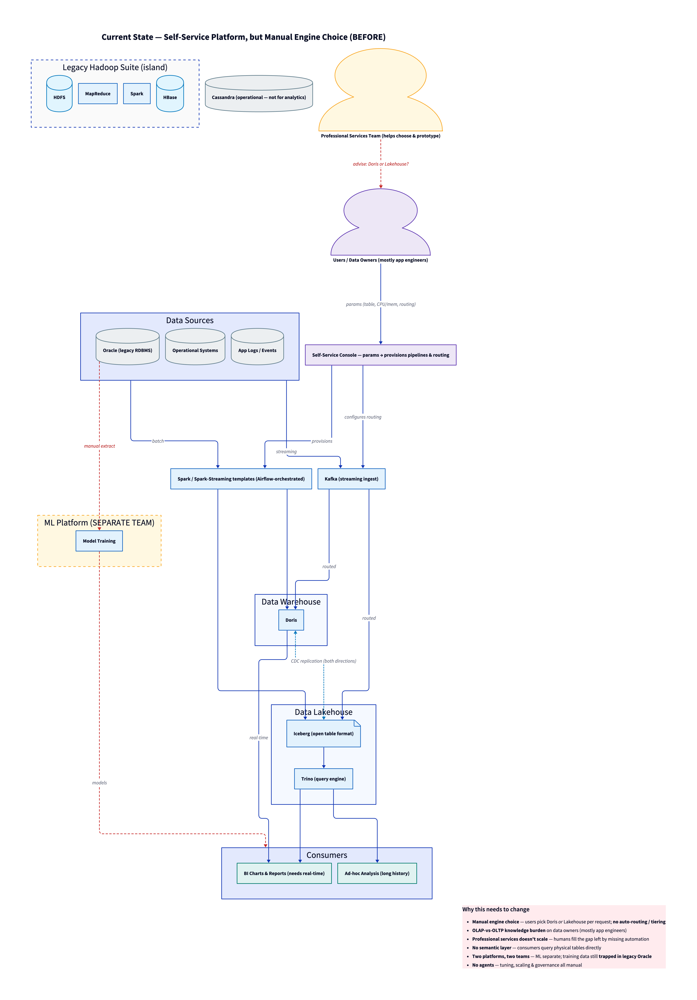

# Data Infrastructure Research — The Agentic Data & AI Operating System

A **3–5 year vision** and a sequenced **3-year roadmap** for evolving a data
platform into a **unified, agent-native Data & AI platform** — converging the
data and ML platforms, putting LLM agents at the center of operation, and shifting
users from a *self-service toolbox that demands expertise* to an *intent-driven
platform that makes the expert decisions for them*.

> ⚠️ Forward-looking research & planning. Conceptual by design — numeric targets,
> KPIs, and headcounts are **illustrative**, meant to be calibrated, not committed.

## Contents

| Document | What it is |
|---|---|
| [`unified-data-ai-platform-plan.md`](./unified-data-ai-platform-plan.md) | The vision/concept note — current state, personas, the four pillars, the 6-layer architectural blueprint, the corrected AI-driven ILM, query routing, online/product-facing serving, and the self-reinforcing RAG knowledge base. |
| [`roadmap-3-year.md`](./roadmap-3-year.md) | The sequenced 3-year roadmap — **Foundation → Intelligence → Autonomy**, agentic maturity ladder, phase gates, KPIs, risks, decisions, and the **team plan**. |

## Architecture at a glance

### Current state — self-service, but manual engine choice


### Target state — unified, agentic Data & AI platform


Diagram sources are [D2](https://d2lang.com/); rendered `.svg` / `.png` are
checked in alongside. To re-render:

```bash
d2 diagram-before-current-state.d2 diagram-before-current-state.svg
d2 diagram-after-future-vision.d2  diagram-after-future-vision.svg
```

## Key ideas

- **Unified Storage** — Apache Iceberg on MinIO as the single *source of truth*
  (not a single physical copy), with AI-driven lifecycle / cache / bounded-copy tiering.
- **Global Semantic Layer** — meaning, metrics, lineage, and governance encoded
  once so every engine and agent answers consistently and correctly.
- **Agentic Control Plane** — agents that auto-route, auto-tune, auto-scale, and
  steward, grounded by a **self-reinforcing RAG knowledge base** built from the platform's own
  query + intent telemetry.
- **Online / product-facing serving** — real-time OLAP + an online feature store
  for ML inference, fed by a streaming backbone and reconciled to the lake.
- **All-build on open source** — assembled from OSS (Iceberg, Trino, Doris, Spark,
  Kafka, Flink, MinIO, …) to avoid vendor lock-in.

## Sources

Synthesized from public material by Meta, AWS, a16z, and Databricks, plus
real-world serving architectures (Uber, LinkedIn, and others). Full citations are
in §10 of the vision document.
